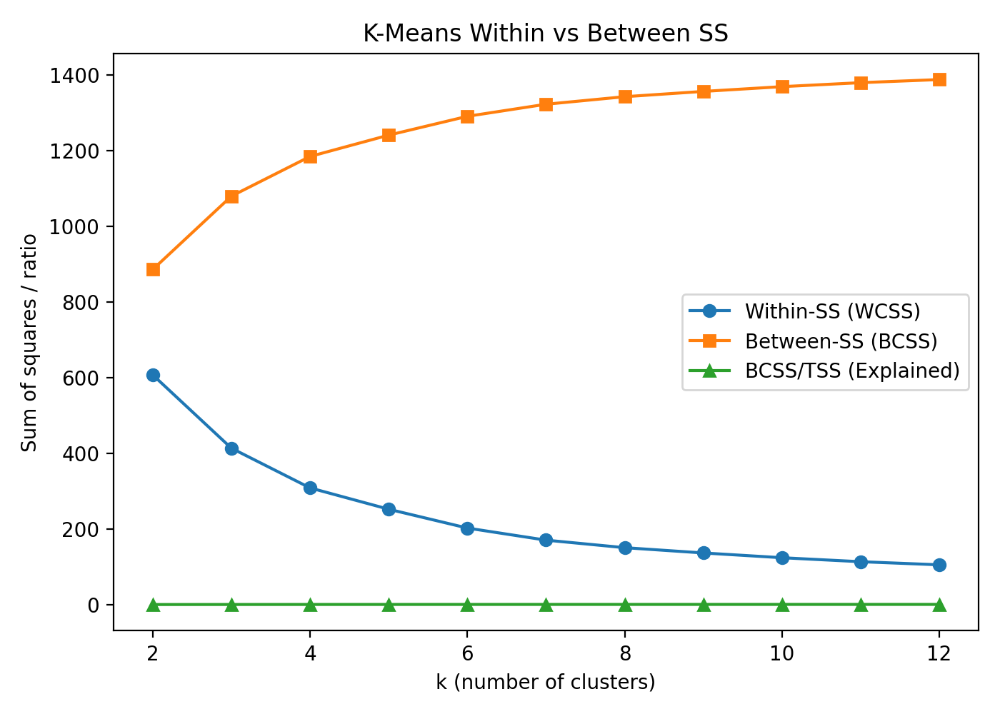

# SYSEN 5530 YouTube digital twin project
 SYSEN 5530 YouTube digital twin project, aiming to build a small-scale testbed that can be used for agentic LLM simulations.   

``Preliminary analysis of optimal clustering for channel types in digital twin.``
## Investigators
(PostDoc) Dr. Cafer Avci (cafer.avci@cornell.edu)  
(MS) Tanya Popli (tp339@cornell.edu)  
(MS) Xinyu She (xs386@cornell.edu)  
(Undergrad) Richard Cai (rjc432@cornell.edu)  
